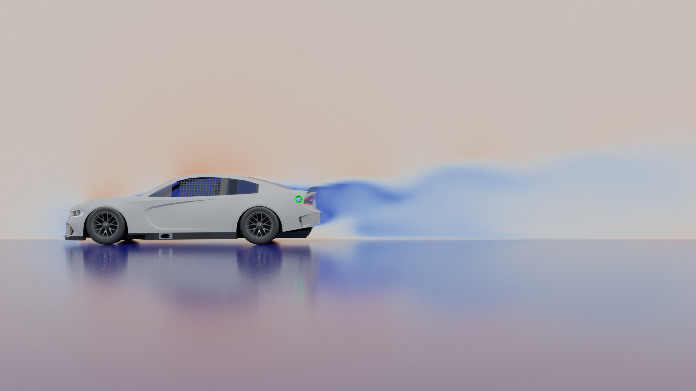

# NASCAR Cup Series Dodge Charger Concept Aerodynamic Optimization

## Introduction
### Project Motivation
Dodge left NASCAR following the 2012 season, but they remain a fan-favorite manufacturer due to their extensive history in the sport. This project features a concept I created as a "what-if" for if Dodge were to return with an entry for the 2022 Cup Series using the Charger Hellcat. I wanted this concept to be not just aesthetically pleasing but also physically accurate in its aerodynamic properties. To accomplish this, I designed a base 3D model to fit the current NASCAR Cup Series designs aesthetically, and then parametrized that design to allow for variations with different shapes and aerodynamics.
### The Problem
Given a base 3D model which can be deformed parametrically to form a design space, how can we optimize these parameters to minimize drag and maximize downforce?
## Usage
### Requirements
This project is designed to be run on Linux systems with the following installed:
- [OpenFOAM v9](https://openfoam.org/version/9/)
- [Blender 2.82](https://www.blender.org/download/releases/2-82/)
- [Python >= 3.8](https://www.python.org/downloads/release/python-380/) with [NumPy](https://numpy.org/) and [BoTorch](https://botorch.org/)

The OpenFOAM physics simulation assumes that there are 6 processors on the device to run in parallel - this can be changed via the configuration files in the template folder.
### Starting the Program
To start a search to minimize drag and maximize downforce in the design space, run `run.py`. Optional parameters can be passed for the number of Bayesian Optimization batches to run for and the number of initial points to sample prior to beginning Bayesian Optimization.
### Resuming
A search can be continued using `run.py` as long as the data file `data/averages.csv` from the previous run still exists.
### Calculating Pareto Front
Once the `averages.csv` file has been populated by data from `run.py`, running `pareto_front.py` will create a file with only points on the Pareto Front of the data set.
### Exporting Designs
Individual designs from the design space can be exported using `export_model.py`. This script is designed to be run in a Blender context - follow the format `blender ./assets/design_space.blend -noaudio -b -P export_model.py -- PARAM1 PARAM2 EXPORT_PATH`. `PARAM1` and `PARAM2` are each in the range [-1,1].
### Sample Data
Sample data from the simulation of 302 designs within the space can be found in the [sample_data](./sample_data/) folder.
